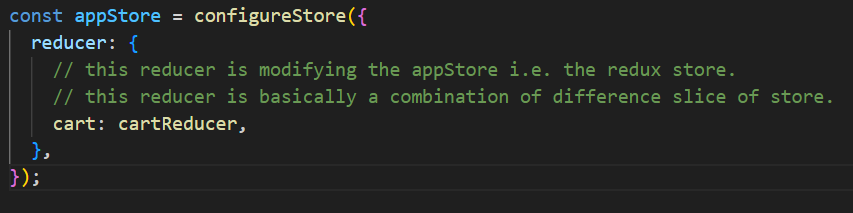
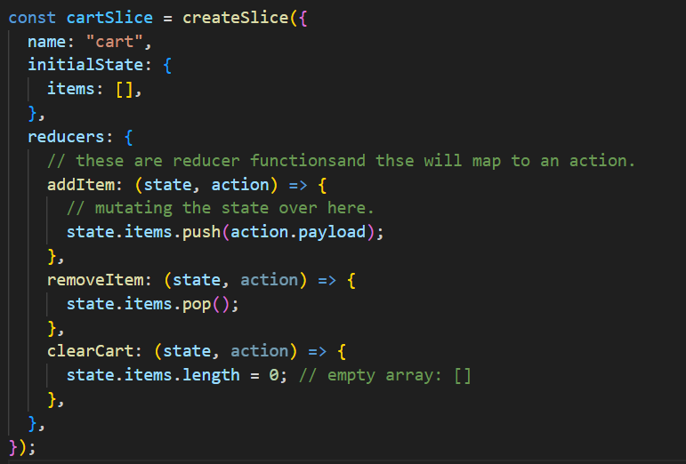
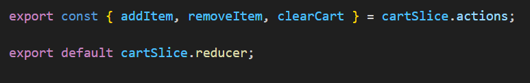

# Namaste React Episode - 08

# URLs

- MENU
- https://www.swiggy.com/dapi/menu/pl?page-type=REGULAR_MENU&complete-menu=true&lat=28.7040592&lng=77.10249019999999&restaurantId=225317&submitAction=ENTER/
- RESTAURANT LIST
- https://www.swiggy.com/dapi/restaurants/list/v5?lat=28.7040592&lng=77.10249019999999&page_type=DESKTOP_WEB_LISTING

# Redux Toolkit

The Redux Toolkit package is intended to be the standard way to write Redux logic. It was originally created to help address three common concerns about Redux:

"Configuring a Redux store is too complicated"
"I have to add a lot of packages to get Redux to do anything useful"
"Redux requires too much boilerplate code"

Redux is a pattern and library for managing and updating application state, using events called "actions". It serves as a centralized store for state that needs to be used across your entire application, with rules ensuring that the state can only be updated in a predictable fashion.

- Install @reduxjs/toolkit and react-redux libraries
- Build our store
- Connect store to our app
- Create a cartSlice
- Dispatch(action)
- Selector

# IMP Interview Question:

- whenever you are doing a selector, make sure you are subscribing to the right portion of the store. Here We can optimize the performaance.

  .. Case 1 - Subscribing to a small portion of the store.
  Here the cart items only update when the "store.cart.items" change. It has nothing to do with any changes happenning outside this slice.

  LINE: const cartItems = useSelctor((store) => store.cart.items);

  .. Case 2 - Subscribing to the whole store. This works perfectly fine. But its very very less efficient.
  Because when the cart is subscribed to the whole store, then any change on any part of the store will update the cart also. For example is any data changes in userSlice then also the cart will be updated. Henceforth its inefficient to subscribe to the whole store itself.
  So, a BETTER PERFORMANCE WAY IS TO SUBSCRIBE TO A SMALL PORTION OF THE STORE.

  LINE1: const store = useSelector((store) => store);
  LINE2: const cartItems = store.cart.items;

-- The name is SELECTOR because we are selecting a specific portion of the store. --

- Reducer and reducers:
  appStore : reducer - single reducer for the entire store. and it can have multiple reducers.
  
  cartSlice: reducers - multiple small reducer functions are written inside a single slice, hence this is reducers. But whhile exporting we are exporting the single reducer.
  
  

# Vanilla Redux - Older:

- Dont MUTATE STATE. This was prohibited inside the older redux.
- We used to create a copy of the state - and then modify the new State.
- Then we used to return the new State, it was mandatory.

# Redux Toolkit:

- We have to MUTATE STATE.
- And we dont have to return anything.
- Redux is doing the BEHIND THE SCENE steps by itself using the immer library, we as developers dont need to do that.

---

https://immerjs.github.io/immer/

## The basic idea is that with Immer you will apply all your changes to a temporary draft, which is a proxy of the currentState. Once all your mutations are completed, Immer will produce the nextState based on the mutations to the draft state. This means that you can interact with your data by simply modifying it while keeping all the benefits of immutable data.

---

# Redux DevTools

- Suppose there are 1000's of components in the app and there are multiple components mutating the same portion
  of the store , subscribing to some portion of the store. React dev tool provide really good debugging tool.
  It has a lot of features including:-
  -> Keep track of the action performed.
  -> maintains a log
  -> we can monitor logs using the tool.
  -> we can also get the chart diagram .
  -> replay option available.
  -> we can have the trace of all the actions performed over the application the user is performing.
  -> simulate the behaviour of user action.

# Redux toolkit

- Redux Toolkit also includes a powerful data fetching and caching capability = RTK Query
